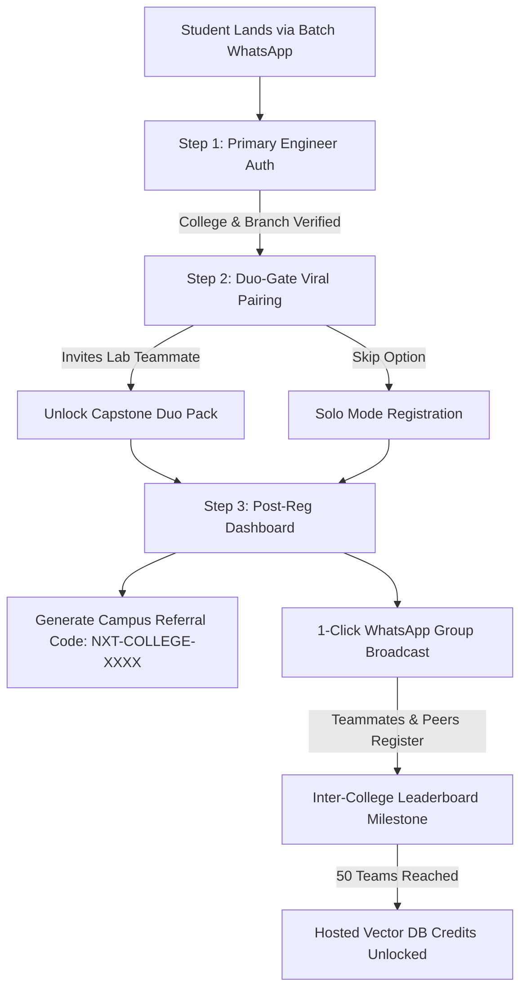

# 🚀 Duo-Gate Referral Accelerator | NxtWave AI Labs

[](https://reactjs.org/)
[](https://vitejs.dev/)
[](https://www.typescriptlang.org/)
[](https://tailwindcss.com/)
[](./LICENSE)
[](#)

> **A high-conversion viral referral web application and capstone accelerator designed for final-year engineering students across India to build, host, and defend an enterprise-grade Retrieval-Augmented Generation (RAG) AI application in 60 minutes.**

---

## 📌 Executive Summary

Final-year B.Tech / B.E. students (Batch 2026/2027) in Tier-2/3 colleges face acute friction during placement season:
1. **Resume Rejection**: Interviewers discard trivial classifier projects (Iris dataset, basic sentiment models) within 10 seconds.
2. **Viva Vulnerability**: 8th-semester external examiners aggressively test architectural choices, vector math, chunking strategies, and latency tradeoffs.
3. **Distribution Bottlenecks**: Traditional university outreach (administrative MoUs, cold emails to TPOs) takes 3–4 weeks and Meta ads burn capital with low intent.

The **Duo-Gate Referral App** engineers viral loops around academic reality: final-year capstone projects are inherently built in pairs or teams of four. By gating high-value perks behind partner pairing and inter-college batch milestones, the platform achieves high viral coefficients ($K \approx 0.77$) with ultra-low CAC.

---

## 🏛 Architecture Diagram



---

## ✨ Key Feature Modules

### 1. ⚡ 2-Step "Duo-Gate" Viral Funnel
* **Step 1: Primary Authentication** — Captures student name, official/personal email, phone, branch, and college via a 30+ university autocomplete index (AKTU, VTU, JNTU, Anna University, SPPU, etc.).
* **Step 2: Duo-Gate Viral Mechanism** — Leverages student collaboration incentives. Registering with a capstone teammate unlocks:
  * **System Architecture Blueprint**
  * **8th-Semester Viva Defense Cheatsheet**
  * **₹1,500 Cloud GPU Credits for Both Seats**
* **Step 3: Post-Registration Command Center** — Provides a personalized campus referral URL (`https://nxtwave.ai/ai-capstone-60m?ref=NXT-AKTU-7194`), 1-click WhatsApp forward message, and instant repository permission status.

### 2. 🏆 Inter-College Batch Leaderboard
* **State & Regional Filtering**: Instant filtering across *Uttar Pradesh, Karnataka, Telangana & AP, Tamil Nadu, and Maharashtra*.
* **Batch Unlock Target**: Live progress bar toward the 50-team threshold to unlock 3 months of free hosted Vector DB instances for the entire college batch.
* **Live Campus Activity Feed**: Real-time ticker streaming fresh pairings from across the nation.

### 3. 💼 Capstone & Placement Asset Vault
* **ATS Resume Builder**: Pre-formatted, ATS-optimized bullet points ($94/100$ score) applying the *Action Verb + Metric + Architecture* formula with 1-click clipboard copying.
* **8th-Semester Viva Defense Simulator**: Interactive flashcards covering tough examiner inquiries (e.g., *RAG vs. Fine-Tuning*, *Recursive Chunking Math*, *HNSW Indexing vs. Flat L2*, *Indirect Prompt Injection Prevention*).
* **System Architecture Blueprint**: Interactive ASCII system flow detailing FastAPI async endpoints, embedding models, Pinecone vector indexing, Groq LPU inference, and Docker containerization.
* **60-Minute Masterclass Timeline**: Minute-by-minute breakdown from environment setup to live deployment.

### 4. 📊 Evaluator Growth Architecture Modal
* **Strategic Growth Thesis**: Explains the viral mechanics bypassing administrative red tape.
* **7-Day Mathematical Funnel Model**: Breakdown demonstrating how 15 Class Reps generate 530 verified registrations within 7 days.
* **₹2,000 Budget Breakdown**: Strict allocation (₹1,500 CR micro-incentives + ₹500 transactional webhooks) delivering a blended **CAC of ₹3.77 per student**.
* **Deliberately Rejected Strategies**: Detailed rationale on why university MoUs, paid Instagram ads, and traditional ambassador programs were discarded.

---

## 📂 Project Directory Structure

The codebase has been refactored from a 1,400+ line monolithic file into clean, modular, and single-responsibility domains:

```text
duogate-referral-app/
├── public/
│   └── favicon.svg                    # Tech brand vector icon
├── src/
│   ├── components/
│   │   ├── common/                    # Reusable UI primitives
│   │   │   ├── CountdownTimer.tsx     # Urgency countdown clock
│   │   │   ├── Footer.tsx             # Global application footer
│   │   │   ├── Header.tsx             # Navigation header & modal trigger
│   │   │   ├── SeatScarcityBar.tsx    # Live seats progress indicator
│   │   │   └── ToastNotification.tsx  # Dynamic floating social proof toasts
│   │   ├── funnel/                    # Viral registration funnel
│   │   │   ├── CollegeAutocomplete.tsx# Accessible dropdown with university search
│   │   │   ├── FunnelContainer.tsx    # Stepper orchestrator & state coordinator
│   │   │   ├── Step1PrimaryForm.tsx   # Primary student identity form
│   │   │   ├── Step2DuoGateForm.tsx   # Teammate pairing & perk unlock form
│   │   │   └── Step3PostRegDashboard.tsx # Referral link & dashboard
│   │   ├── hero/                      # Hero section & value proposition
│   │   │   ├── FeaturePillars.tsx     # 4 value pillars
│   │   │   └── HeroBanner.tsx         # Headline, subtitle, scarcity gauge
│   │   ├── leaderboard/               # Inter-college competition
│   │   │   ├── CampusLiveActivity.tsx # Real-time recent signups stream
│   │   │   ├── LeaderboardCard.tsx    # Individual college rank card
│   │   │   ├── LeaderboardList.tsx    # Filterable university ranking board
│   │   │   └── TrophyIcon.tsx         # Vector trophy icon
│   │   ├── modals/                    # Overlay dialogs
│   │   │   └── EvaluatorMathModal.tsx # 7-day funnel math & budget breakdown
│   │   └── vault/                     # Post-workshop deliverable assets
│   │       ├── ArchitectureBlueprintTab.tsx # System diagrams & latency benchmarks
│   │       ├── AssetVault.tsx         # Tabbed container for assets
│   │       ├── CurriculumTimelineTab.tsx    # 60-minute session breakdown
│   │       ├── ResumeBuilderTab.tsx   # Copyable ATS resume bullet points
│   │       └── VivaSimulatorTab.tsx   # Examiner Q&A interactive flashcards
│   ├── data/                          # Isolated mock datasets & static constants
│   │   ├── branches.ts                # Engineering branches list
│   │   ├── capstoneDomains.ts         # Project track options
│   │   ├── colleges.ts                # 30+ regional engineering universities
│   │   ├── growthMathData.ts          # Budget & funnel tables for evaluators
│   │   ├── leaderboardData.ts         # Initial university scores & targets
│   │   ├── mockStreamData.ts          # Seed registration stream events
│   │   ├── timelineSteps.ts           # 60-min build milestones
│   │   └── vivaCards.ts               # Model viva defense Q&A entries
│   ├── hooks/                         # Custom React hooks
│   │   ├── useClipboard.ts            # Clipboard copy helper with fallback
│   │   ├── useCountdown.ts            # Live decrementing timer hook
│   │   └── useToastStream.ts          # Rotating campus notification streamer
│   ├── types/
│   │   └── index.ts                   # Centralized TypeScript interface definitions
│   ├── utils/                         # Reusable pure utility functions
│   │   ├── referralGenerator.ts       # State/college referral code generator
│   │   └── shareFormatters.ts         # WhatsApp message & URL builders
│   ├── App.tsx                        # Main application orchestrator
│   ├── index.css                      # Tailwind base & custom scrollbar styles
│   └── main.tsx                       # React DOM entry point
├── .gitignore                         # Git exclusion rules
├── index.html                         # HTML5 shell with Google Inter font
├── LICENSE                            # MIT License
├── package.json                       # Scripts and project dependencies
├── postcss.config.js                  # PostCSS plugins configuration
├── tailwind.config.js                 # Tailwind CSS theme extensions & animations
├── tsconfig.json                      # Strict TypeScript compiler options
└── vite.config.ts                     # Vite bundler configuration
```

---

## 🛠 Tech Stack

| Layer | Technology | Purpose |
| :--- | :--- | :--- |
| **Framework** | [React 18.3](https://reactjs.org/) | Declarative UI state management and reactive funnels |
| **Tooling / Bundler** | [Vite 6.0](https://vitejs.dev/) | Sub-second Hot Module Replacement (HMR) and optimized builds |
| **Language** | [TypeScript 5.6](https://www.typescriptlang.org/) | End-to-end type safety across domain models and components |
| **Styling** | [Tailwind CSS 3.4](https://tailwindcss.com/) | Custom design system, dark glassmorphism, responsive grid |
| **Icons** | [Lucide React](https://lucide.dev/) | Modern, lightweight SVG iconography |
| **Typography** | [Inter](https://fonts.google.com/specimen/Inter) | Crisp technical font pairing |

---

## 🚀 Quickstart Guide

### 1. Clone or Open the Workspace
```bash
git clone https://github.com/your-username/duogate-referral-app.git
cd duogate-referral-app
```

### 2. Install Dependencies
```bash
npm install
```

### 3. Launch Development Server
```bash
npm run dev
```
Open your browser at `http://localhost:5173` to explore the live application.

### 4. Build for Production
```bash
npm run build
```
Production assets are generated in the `dist/` directory, ready to deploy to Render, Vercel, Netlify, or Cloudflare Pages.

---

## 🧪 Growth Funnel Mathematics (Evaluator Cheat-Sheet)

| Distribution Channel | Input Traffic | Conversion | Registrations Yield |
| :--- | :--- | :--- | :--- |
| **15 Batch WhatsApp Groups (CR Pins)** | 900 student clicks | ~33% Primary Form | **300 Primary Regs** |
| **Duo-Gate Viral Mechanism** | 300 Primary users | 65% pair a partner | **+195 Duo Regs** |
| **Inter-College Leaderboard FOMO** | Campus sharing | Organic $K=0.12$ | **+35 Organic Regs** |
| **Total 7-Day Expected Yield** | **~1,150 visits** | **Blended 46%** | **530 Verified Regs** |

* **Total Budget**: ₹2,000 (₹1,500 CR incentives + ₹500 WhatsApp Cloud API)
* **Blended Customer Acquisition Cost (CAC)**: $\frac{₹2,000}{530} =$ **₹3.77 per verified student**.

---

## 📄 License

This project is licensed under the [MIT License](./LICENSE). Feel free to adapt and build upon it.
